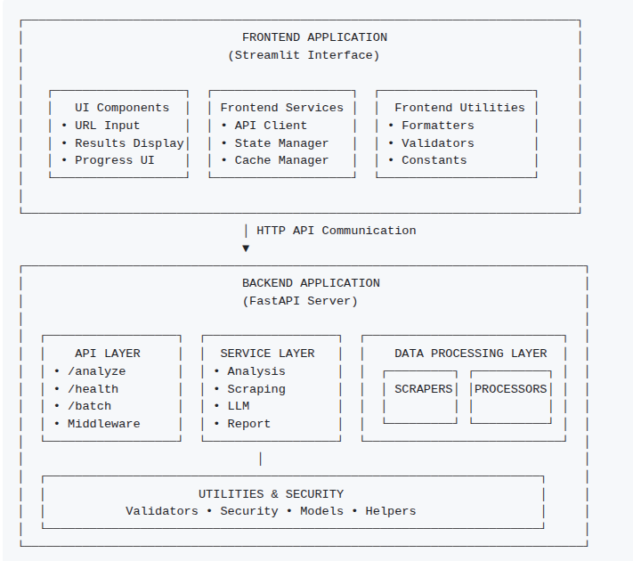

**Project** **2** **-** **Web** **Content** **Analyzer** **-**

**Technical** **Implementation** **Guide**

**Project** **2** **-** **Web** **Content** **Analyzer** **-**
**Technical** **Implementation** **Guide** **1** 1. Project Overview &
Learning Objectives 1 2. Implementation Strategy & Copilot Integration 2
3. Milestone 1: Web Scraping Foundation 3 4. Milestone 2: Content
Processing Pipeline 5 5. Milestone 3: Production Features & Advanced
Analysis 7 6. Success Validation & Testing 8 7. Extension Opportunities
9 8. Glossary 10

**1.** **Project** **Overview** **&** **Learning** **Objectives**

**Business** **Context**

> Build a web application that extracts content from any website URL and
> generates a comprehensive analysis report using LLM in just 2 days.
> This accelerated timeline leverages your Project 1 experience for
> rapid development, focusing on web scraping, content processing, and
> AI-powered analysis.

**Architecture**
**Overview**

**Core** **Learning** **Goals**

> ● Web Scraping: Professional content extraction with BeautifulSoup and
> requests
>
> ● Content Processing: Advanced text cleaning and structuring pipelines
> ● AI Analysis: Multi-faceted content analysis with structured outputs
>
> ● Security Implementation: SSRF prevention and input sanitization
>
> ● API Development: Building FastAPI endpoints for web content analysis

**2.** **Implementation** **Strategy** **&** **Copilot** **Integration**

**Development** **Approach**

> This project builds on Project 1's foundation while introducing web
> scraping workflows, content processing pipelines, and comprehensive AI
> analysis patterns. Focus on delivering a functional web content
> analyzer within the 2-day timeline.

**Copilot** **Optimization** **Tips**

> ● Specify scraping requirements (BeautifulSoup, requests,
> anti-detection) ● Include security considerations for SSRF prevention
>
> ● Request structured output formats for AI analysis results ● Ask for
> error handling patterns for network operations

**3.** **Milestone** **1:** **Web** **Scraping** **Foundation**

**3.1** **Project** **Structure** **Enhancement**

**Extended** **Architecture** **Pattern**

> Copilot Prompt: *"Create* *a* *project* *structure* *for* *a* *web*
> *content* *analyzer* *with* *separate* *modules* *for* *scraping,*
> *content* *processing,* *AI* *analysis,* *and* *report* *generation.*
> *Include* *proper* *separation* *of* *concerns* *and* *security*
> *considerations."*
>
> None
>
> project_root/
>
> ├── backend/ \# BACKEND APPLICATION (FastAPI) │ ├── src/
>
> │ │ ├── api/ \# API LAYER
>
> │ │ │ ├── \_\_init\_\_.py │ │ │ ├── routes.py
>
> │ │ │ └── middleware.py

\# API endpoints

\# Request/response middleware

> │ │ ├── services/ \# SERVICE LAYER │ │ │ ├── \_\_init\_\_.py
>
> │ │ │ ├── analysis_service.py │ │ │ ├── scraping_service.py │ │ │ └──
> report_service.py
>
> │ │ ├── scrapers/ \# DATA LAYER - Web Scraping │ │ │ ├──
> \_\_init\_\_.py
>
> │ │ │ ├── web_scraper.py
>
> │ │ │ └── content_extractor.py
>
> │ │ ├── processors/ \# DATA LAYER - Content Processing │ │ │ ├──
> \_\_init\_\_.py
>
> │ │ │ ├── text_processor.py │ │ │ └── content_cleaner.py
>
> │ │ ├── models/ \# DATA MODELS │ │ │ ├── \_\_init\_\_.py
>
> │ │ │ └── data_models.py
>
> │ │ └── utils/
>
> │ │ ├── validators.py │ │ ├── security.py
>
> │ │ ├── exceptions.py
>
> │ │ └── helpers.py

\# UTILITIES & SECURITY

\# URL validation & SSRF prevn \# Content sanitization

\# Custom exceptions

\# Helper functions

> │ ├── config/ \# CONFIGURATION │ │ └── settings.py
>
> │ ├── tests/ \# BACKEND TESTS │ │ ├── test_api.py
>
> │ │ └── test_services.py
>
> │ ├── main.py
>
> │ ├── requirements.txt
>
> │ └── Dockerfile

\# Main FastAPI app entry point \# Backend dependencies

\# Backend container definition

> │
>
> ├── frontend/ \# FRONTEND APP (Streamlit) │ ├── src/
>
> │ │ ├── components/ \# UI COMPONENTS │ │ │ ├── url_input.py
>
> │ │ │ ├── results_display.py │ │ │ └── progress.py
>
> │ │ ├── services/ \# FRONTEND SERVICES
>
> │ │ │ ├── api_client.py
>
> │ │ │ └── state_manager.py

\# Backend API client

\# Streamlit state management

> │ │ └── utils/
>
> │ │ ├── formatters.py
>
> │ │ └── validators.py

\# FRONTEND UTILITIES \# Result formatting

\# Frontend input validation

> │ ├── assets/ \# STATIC ASSETS │ │ └── styles.css \# Custom styling
>
> │ ├── templates/ \# REPORT TEMPLATES │ │ └── report_template.html
>
> │ ├── app.py
>
> │ ├── requirements.txt │ └── Dockerfile
>
> │

\# Main Streamlit application \# Frontend dependencies

\# Frontend container def

> ├── docker-compose.yml
>
> └── README.md

\# orchestration

\# Project documentation

**3.2** **Web** **Scraping** **Service**

**Professional** **Content** **Extraction**

> Copilot Prompt: *"Build* *a* *robust* *web* *scraper* *using*
> *BeautifulSoup* *and* *requests* *with* *user-agent* *rotation,*
> *timeout* *handling,* *content* *type* *validation,* *and*
> *anti-detection* *measures.* *Include* *proper* *error* *handling*
> *for* *network* *failures."*
>
> Key Implementation Areas:
>
> ● User-agent rotation and headers management ● Request timeout and
> retry logic
>
> ● Content type validation and size limits ● Anti-bot detection
> avoidance
>
> ● Rate limiting and respectful crawling
>
> Expected Service Pattern:
>
> Python
>
> class WebScraperService: def \_\_init\_\_(self):
>
> \# Initialize session with proper headers
>
> async def scrape_url(self, url: str) -\> ScrapedContent: \# Safe
> content extraction
>
> def \_validate_url(self, url: str) -\> bool: \# Security validation

**3.3** **Content** **Extraction** **Engine**

**Intelligent** **Content** **Processing**

> Copilot Prompt: *"Create* *a* *content* *extraction* *engine* *that*
> *intelligently* *identifies* *main* *content,* *removes* *navigation*
> *and* *ads,* *extracts* *metadata,* *and* *handles* *various* *HTML*
> *structures.* *Include* *support* *for* *common* *CMS* *patterns."*
>
> Core Processing Features:
>
> ● Main content identification algorithms ● Navigation and advertisement
> removal
>
> ● Metadata extraction (title, description, keywords) ● Image and media
> content handling
>
> ● Structured data extraction (JSON-LD, microdata)

**3.4** **Security** **Implementation**

**SSRF** **Prevention** **and** **Input** **Validation**

> Copilot Prompt: *"Implement* *comprehensive* *security* *measures*
> *including* *SSRF* *prevention,* *URL* *validation,* *content* *size*
> *limits,* *and* *malicious* *content* *detection* *for* *a* *web*
> *scraping* *application."*
>
> Security Components:
>
> ● URL whitelist/blacklist validation ● Private IP range blocking
>
> ● Content length restrictions ● File type validation
>
> ● XSS prevention in scraped content

**4.** **Milestone** **2:** **Content** **Processing** **Pipeline**

**4.1** **Text** **Processing** **Service**

**Advanced** **Content** **Cleaning**

> Copilot Prompt: *"Build* *a* *text* *processing* *pipeline* *that*
> *cleans* *HTML* *content,* *removes* *unwanted* *elements,*
> *normalizes* *text* *formatting,* *extracts* *key* *information,*
> *and* *prepares* *content* *for* *AI* *analysis."*
>
> Processing Capabilities:
>
> ● HTML tag removal and text extraction ● Whitespace normalization
>
> ● Special character handling ● Language detection
>
> ● Content summarization preparation

**4.2** **Content** **Structure** **Analysis**

**Document** **Understanding**

> Copilot Prompt: *"Create* *a* *content* *analyzer* *that* *identifies*
> *document* *structure,* *extracts* *headings* *hierarchy,* *finds*
> *key* *sections,* *detects* *content* *types,* *and* *prepares*
> *structured* *data* *for* *AI* *processing."*
>
> Analysis Features:
>
> ● Heading hierarchy detection ● Section identification
>
> ● Content type classification ● Key phrase extraction
>
> ● Document outline generation

**4.3** **Data** **Models** **and** **Validation**

**Structured** **Data** **Handling**

> Copilot Prompt: *"Design* *Pydantic* *models* *for* *URL* *requests,*
> *scraped* *content,* *analysis* *results,* *and* *report* *generation*
> *with* *comprehensive* *validation* *rules* *and* *error* *handling."*
>
> Model Architecture:
>
> ● URLAnalysisRequest: Input validation
>
> ● ScrapedContent: Raw content structure
>
> ● ProcessedContent: Cleaned and structured data ● AnalysisReport:
> Final output format

**5.** **Milestone** **3:** **Production** **Features** **&**
**Advanced**

**Analysis**

**5.1** **Multi-Faceted** **Content** **Analysis**

**Comprehensive** **AI** **Analysis** **Engine**

> Copilot Prompt: *"Build* *an* *AI* *analysis* *service* *that*
> *performs* *content* *summarization,* *sentiment* *analysis,* *topic*
> *extraction,* *SEO* *analysis,* *readability* *scoring,* *and*
> *competitive* *insights* *using* *LLM* *APIs."*
>
> Analysis Dimensions:
>
> ● Content summarization and key points
>
> ● Sentiment and tone analysis
>
> ● Topic and theme identification
>
> ● SEO optimization recommendations ● Readability and accessibility
> scoring ● Competitive positioning insights

**5.2** **Structured** **Report** **Generation**

**Professional** **Report** **Creation**

> Copilot Prompt: *"Create* *a* *report* *generation* *service* *that*
> *combines* *AI* *analysis* *results* *into* *professional* *HTML/PDF*
> *reports* *with* *visualizations,* *charts,* *and* *actionable*
> *recommendations."*
>
> Report Components:
>
> ● Executive summary generation ● Detailed analysis sections
>
> ● Visual data representations
>
> ● Actionable recommendations ● Competitive benchmarking

**5.3** **Advanced** **Features** **&** **Export**

**Enhanced** **UI** **and** **Export** **Functionality**

> Copilot Prompt: *"Create* *an* *enhanced* *Streamlit* *interface*
> *with* *advanced* *report* *formatting,* *batch* *processing*
> *capabilities* *for* *multiple* *URLs,* *and* *export* *functionality*
> *to* *PDF,* *JSON,* *and* *CSV* *formats."*
>
> Production Features:
>
> ● Advanced report formatting and data visualization ● Batch processing
> capabilities for multiple URLs
>
> ● Export functionality (PDF, JSON, CSV)
>
> ● Enhanced UI with progress indicators and status updates ● Analysis
> history management

**5.4** **Documentation** **&** **Testing**

**Comprehensive** **Documentation**

> Copilot Prompt: *"Create* *comprehensive* *project* *documentation*
> *including* *setup* *instructions,* *API* *documentation,* *testing*
> *procedures,* *and* *deployment* *guidelines* *for* *a* *web*
> *content* *analyzer."*
>
> Documentation Requirements:
>
> ● Comprehensive README with setup instructions
>
> ● Code documentation with docstrings and inline comments ● Testing
> procedures and website validation
>
> ● Sample analyses and usage examples

**6.** **Success** **Validation** **&** **Testing**

**Functional** **Requirements** **Checklist**

> ● Web Scraping: Reliable content extraction from various sites ●
> Content Processing: Clean, structured content preparation ● AI
> Analysis: Comprehensive multi-dimensional analysis
>
> ● Report Generation: Professional, actionable reports ● Security: SSRF
> prevention and input validation

**Technical** **Standards**

> ● Performance: Sub-30-second analysis for typical pages
>
> ● Reliability: 80%+ successful extraction rate across diverse websites
> ● Security: No SSRF vulnerabilities or data leakage
>
> ● Functionality: Handle various website layouts and content types ●
> Quality: Comprehensive error handling and user feedback

**User** **Experience** **Goals**

> ● Intuitive Workflow: Clear, guided analysis process
>
> ● Visual Feedback: Real-time progress and status updates ●
> Professional Output: High-quality, actionable reports
>
> ● Error Recovery: Graceful handling of failed analyses
>
> ● Performance: Responsive interface during processing
>
> **7.** **Extension** **Opportunities**
>
> **Stretch** **Goals** **(If** **Time** **Permits)**
>
> ● Multiple URL Analysis: Analyze and compare multiple websites ●
> Advanced Scraping: Handle JavaScript-heavy sites with Selenium
>
> ● Content Categories: Detect and categorize different types of websites
> ● Analysis History: Store and retrieve previous analyses
>
> ● Enhanced Export: Download analysis as PDF or Word document
>
> **Future** **Enhancements**
>
> ● Chrome DevTools Integration: JavaScript-rendered content ● API
> Integration: Social media and analytics platform data
>
> ● Machine Learning: Custom content scoring models
>
> ● Multi-language Support: International content analysis ● Real-time
> Monitoring: Automated competitive tracking
>
> **8.** **Glossary**
>
> **Technical** **Terms** **&** **Acronyms**

||
||
||
||
||
||

||
||
||
||
||
||
||
||
||
||
||
||
||
||
||

||
||
||
||
||
||
||

> **Architecture** **Terms**

||
||
||
||
||
||
||
||

> **Development** **Terms**

||
||
||

||
||
||
||
||
||
||
||
